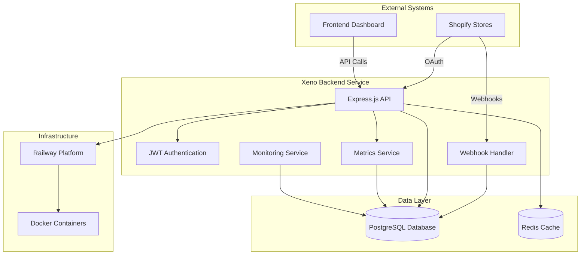
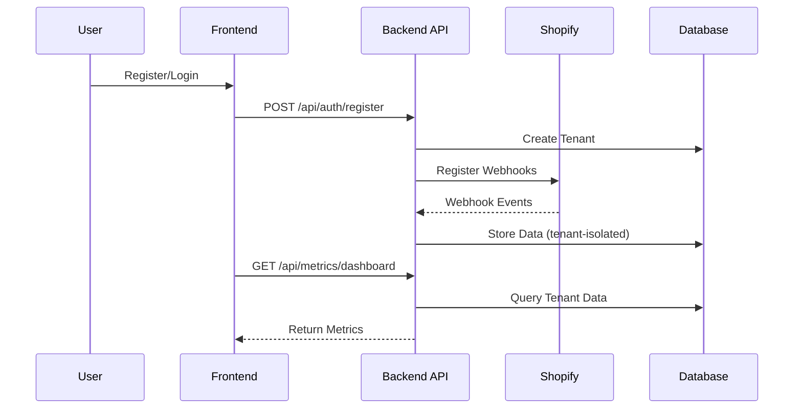
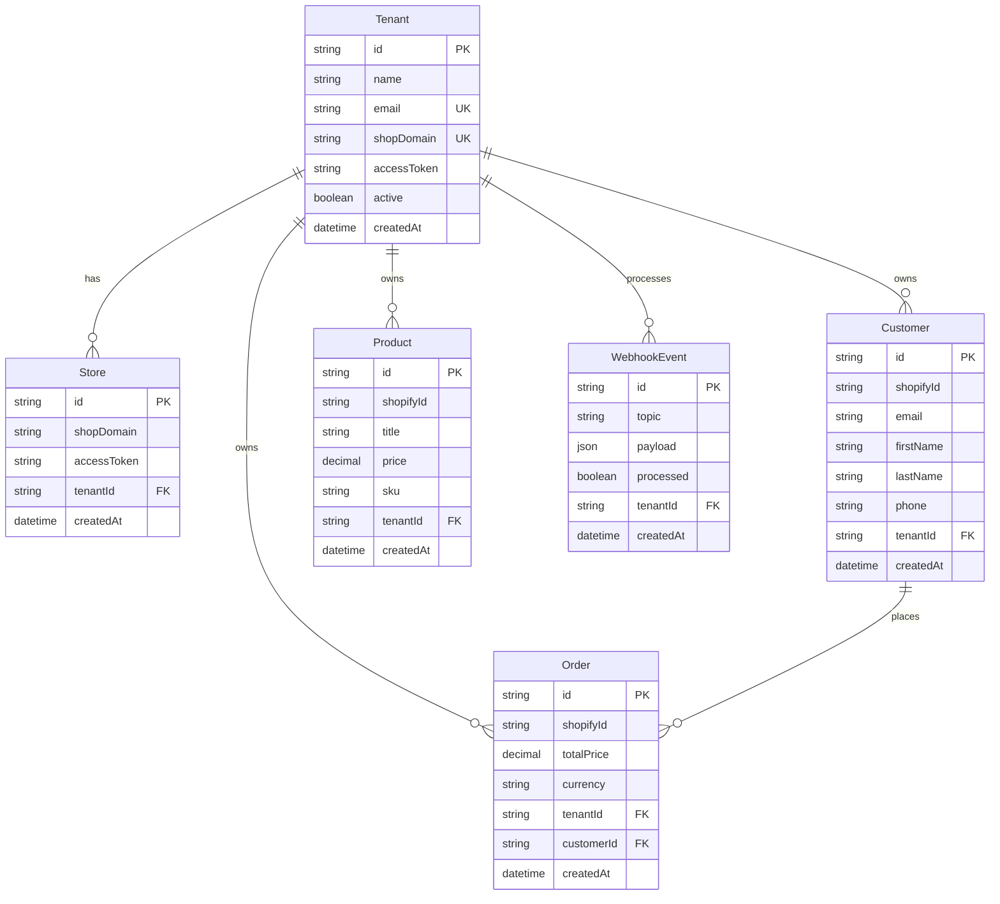
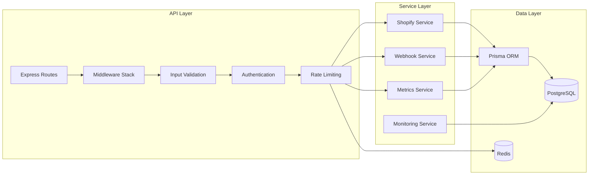
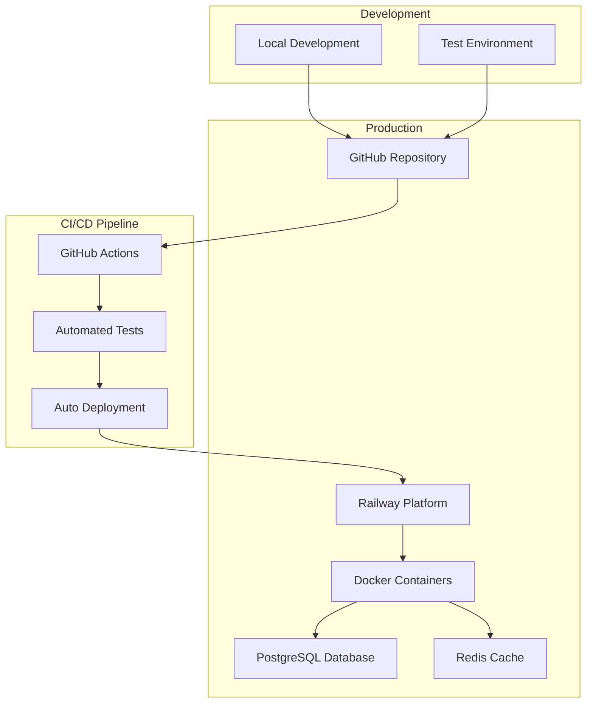
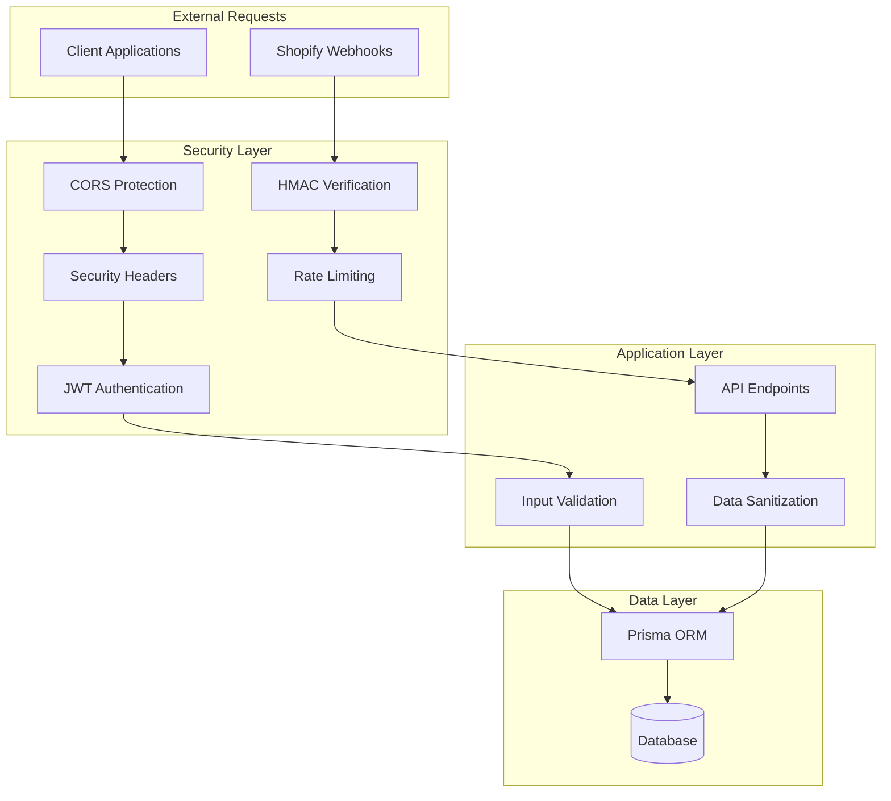
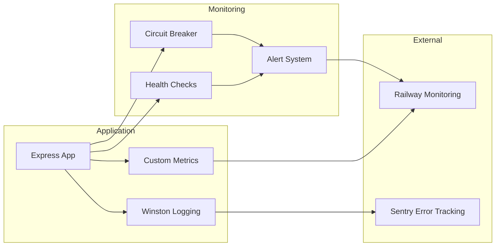

# System Architecture

## High-Level Architecture

## Multi-Tenant Data Flow

## Database Schema

## API Architecture

## Deployment Architecture

## Security Architecture

## Monitoring & Observability

## Assumptions & Design Decisions

### Multi-Tenancy Approach
- **Tenant Isolation**: Database-level isolation using tenantId foreign keys
- **Data Segregation**: All queries include tenantId filter
- **Security**: JWT tokens include tenantId for authorization

### Webhook Processing
- **Idempotency**: Webhook events are deduplicated using (tenantId, topic, shopifyId)
- **Retry Logic**: Failed webhooks are retried with exponential backoff
- **Circuit Breaker**: Prevents cascade failures during high error rates

### Database Design
- **Normalization**: Proper 3NF schema with foreign key relationships
- **Indexing**: Composite indexes on (tenantId, shopifyId) for performance
- **Migrations**: Prisma migrations for schema versioning

### API Design
- **RESTful**: Standard HTTP methods and status codes
- **Pagination**: Cursor-based pagination for large datasets
- **Rate Limiting**: Tenant-specific rate limits using Redis

### Deployment Strategy
- **Containerization**: Docker for consistent deployments
- **Platform**: Railway for managed infrastructure
- **CI/CD**: GitHub Actions for automated testing and deployment

## Next Steps for Production

1. **Frontend Dashboard**: React.js UI for data visualization
2. **Advanced Monitoring**: APM integration (DataDog, New Relic)
3. **Caching Strategy**: Redis caching for frequently accessed data
4. **Load Balancing**: Multiple instances behind load balancer
5. **Backup Strategy**: Automated database backups
6. **Security Audit**: Penetration testing and security review
7. **Performance Testing**: Load testing with realistic traffic
8. **Documentation**: API documentation with Swagger/OpenAPI
